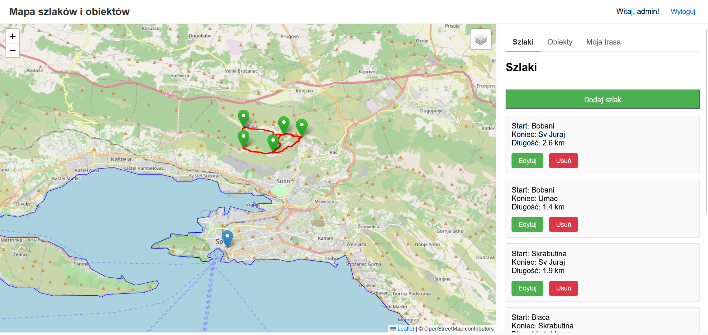

# Hiking map for Croatia



## Project overview

The project is a web-based GIS application designed for managing and visualizing hiking trails, tourist objects, and administrative regions in Croatia.

The system was developed using:

- Django / GeoDjango
- PostgreSQL + PostGIS
- Leaflet.js
- JavaScript

The application supports:
- displaying spatial data on interactive maps,
- importing trails from `.gpx` files,
- managing tourist objects and trail nodes,
- assigning objects to regions and settlements automatically using spatial procedures,
- role-based access for administrators and users.

---

# System architecture

## Backend

The backend layer is implemented using Django and GeoDjango.

Responsibilities:
- database communication,
- spatial query handling,
- GPX parsing,
- GeoJSON generation,
- authentication and authorization,
- business logic.

### Main backend components

| Component | Purpose |
|---|---|
| Django | Web framework |
| GeoDjango | Spatial data support |
| PostgreSQL | Relational database |
| PostGIS | Spatial extension |
| GPXPy | GPX file parser |

---

## Frontend

Frontend technologies:
- HTML5
- CSS3
- JavaScript
- Leaflet.js

Responsibilities:
- interactive map rendering,
- displaying GeoJSON layers,
- user interaction with map objects,
- selecting trail nodes directly on the map.

---

## Spatial database architecture

The application uses PostgreSQL with the PostGIS extension.

### Core tables

| Table | Description |
|---|---|
| `regiony` | administrative regions |
| `miejscowosci` | settlements |
| `obiekty` | tourist objects |
| `rodzaje_obiektow` | object categories |
| `wezly` | trail nodes |
| `szlaki` | hiking trails |
| `uzytkownicy_pro` | premium users |
| `miejsca_uzytkownika` | user favorite places |
| `szlaki_w_trasie` | user route relations |

---

# Spatial mechanisms

The system uses PostgreSQL triggers and PL/pgSQL procedures to automate spatial operations.

Implemented mechanisms include:
- automatic region assignment,
- automatic settlement assignment,
- trail length calculation,
- ascent/descent calculation based on Z dimension geometry.

---

# Technologies

| Technology | Role |
|---|---|
| Python | Backend language |
| Django | Web framework |
| GeoDjango | GIS integration |
| PostgreSQL | Database |
| PostGIS | Spatial extension |
| Leaflet | Interactive maps |
| JavaScript | Frontend logic |
| GPXPy | GPX parsing |

---

# Environment setup

## Virtual environment

### Windows CMD

```cmd
venv\Scripts\activate
```

### PowerShell

```powershell
.\venv\Scripts\Activate.ps1
```

---

# Installing dependencies

```bash
pip install -r requirements.txt
```

---

# Database configuration

Configure PostgreSQL connection inside:

```txt
gis_project/settings.py
```

Example configuration:

```python
DATABASES = {
    'default': {
        'ENGINE': 'django.contrib.gis.db.backends.postgis',
        'NAME': 'Projekt_BD2',
        'USER': 'postgres',
        'PASSWORD': 'password',
        'HOST': 'localhost',
        'PORT': '5432',
    }
}
```

---

# Running migrations

```bash
python manage.py migrate
```

---

# Creating admin account

```bash
python manage.py createsuperuser
```

---

# Starting the development server

```bash
python manage.py runserver
```

---

# Application endpoints

| Endpoint | Description |
|---|---|
| `/` | main map view |
| `/admin/` | Django admin panel |
| `/dodaj-szlak/` | trail import form |
| `/dodaj-obiekt/` | object creation form |
| `/api/szlaki/` | trails GeoJSON |
| `/api/obiekty/` | objects GeoJSON |
| `/api/wezly/` | nodes GeoJSON |
| `/regiony_geojson/` | regions GeoJSON |

---

# GPX import workflow

Trail import process:
1. Upload GPX file,
2. Parse track geometry,
3. Create `LINESTRING Z`,
4. Calculate trail metrics,
5. Assign start/end nodes,
6. Store geometry in PostGIS.

---

# Security mechanisms

Implemented security features:
- Django authentication system,
- administrator-only access decorators,
- CSRF protection,
- server-side validation,
- role-based functionality separation.

---

# Selected functionalities

## Interactive map
- region visualization,
- object visualization,
- trail rendering,
- node selection.

## Trail management
- GPX import,
- node assignment,
- automatic metric calculation.

## Object management
- object creation,
- spatial region detection,
- settlement assignment.

---

# Development notes

The project uses:
- GeoJSON as spatial API format,
- Leaflet layers for rendering,
- PostGIS spatial operators (`ST_Contains`, `ST_Length`, `ST_Transform`),
- triggers for automatic data processing.

---

# Author

Developed as part of a university database systems project.
